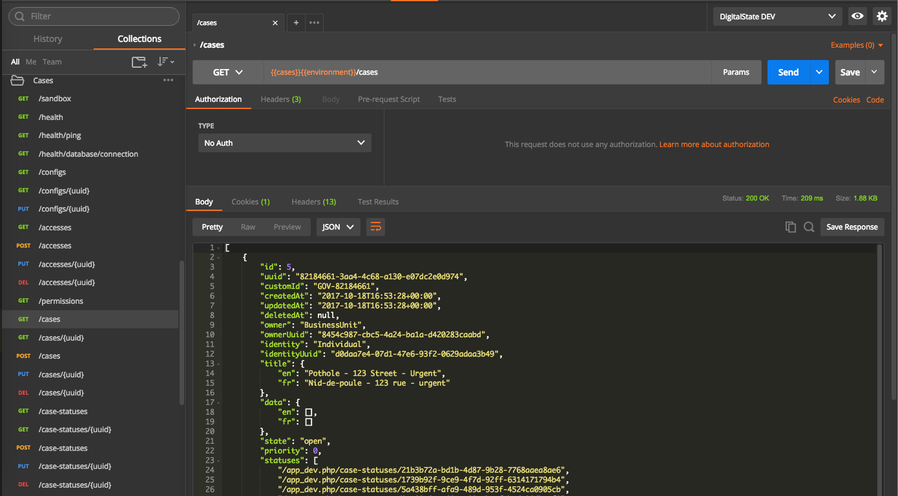
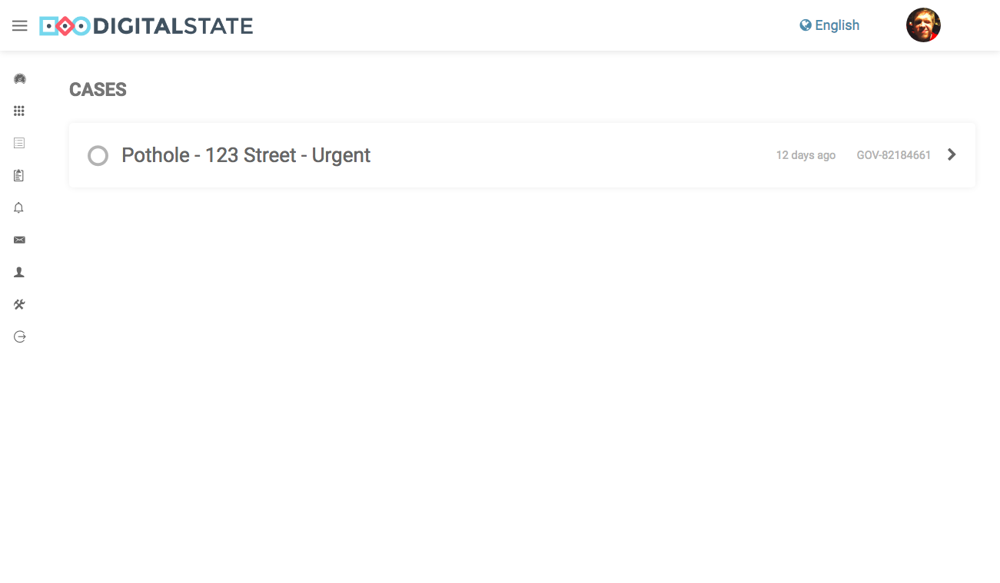
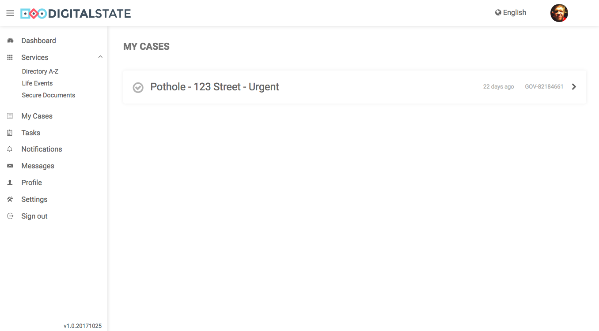
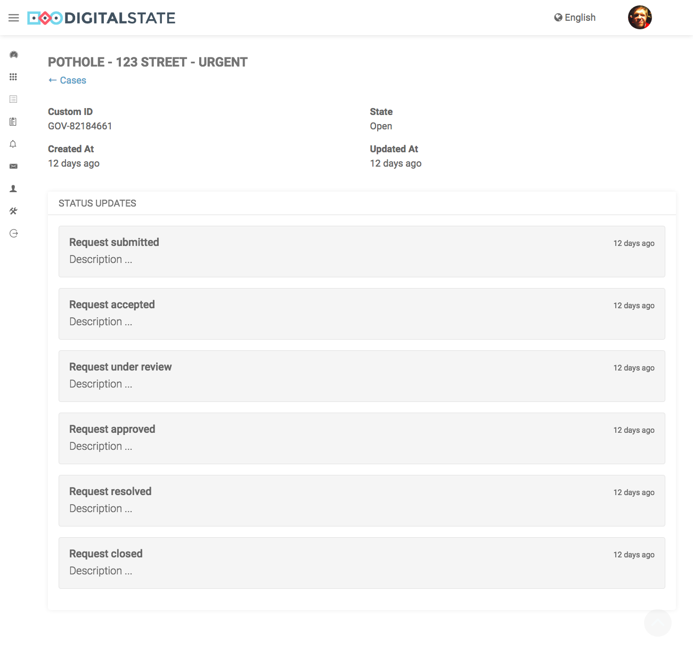
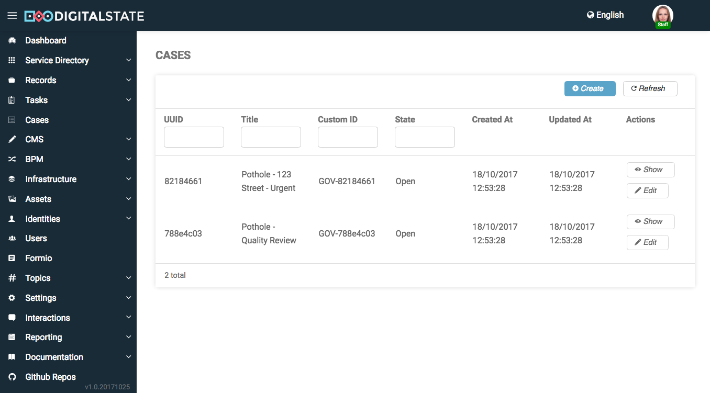
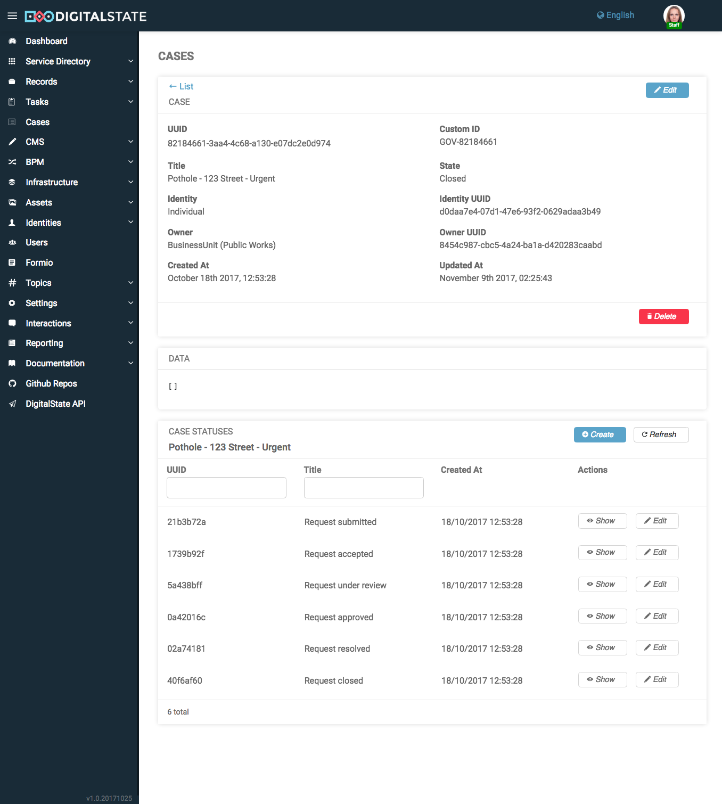
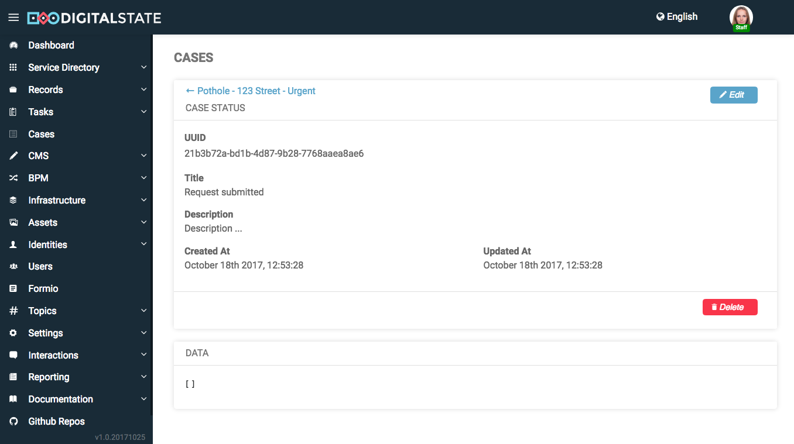

# Cases

The Cases microservice provides a light weight and expandable case/ticketing system.

The purpose of Cases is to provide a "thing" to group work as well as create cases/tickets that align/link with internal case/ticket management systems that may not have web interfaces or you may wish to manage the experience differently.

Cases are made up of several entities:

1. Case
1. Case Statuses (Status Updates)
1. Case Associations

Entities that are in the pipeline for release:

1. Metadata
1. Notes
1. Discussions
1. KPIs


Cases are primarily controlled and managed through Workflow/Camunda.  BPMN processes manage the data flow and interactions with Cases and other microservice.

The goal is to always ensure that a business unit can build and manage their ticketing/cases in any way they wish.  Cases is designed to always conform to how the business unit functions, and does not attempt to make the business unit change to match the way the software was designed.


## Screenshots

The following are screenshots from the Postman, Portal and Admin UIs for Cases microservice:


### Postman



### Portal



---



---




### Admin



---



---



[](https://travis-ci.org/DigitalState/Cases)

## Table of Contents

- [Synopsis](#synopsis)
- [Installation](#installation)
- [Documentation](#documentation)
- [Contributing](#contributing)
- [History](#history)
- [Credits](#credits)

## Synopsis

Synopsis...

## Installation

Run docker.

```
docker-compose up -d
```

Run database migrations.

```
docker-compose exec php php bin/console doctrine:migrations:migrate
```

Run dev data fixtures (optional).

```
docker-compose exec php php bin/console doctrine:fixtures:load
```

## Documentation

Documentation...

## Contributing

Please read [CONTRIBUTING.md](CONTRIBUTING.md) for details on our code of conduct, and the process for submitting pull requests to us.

## History

History..

## Credits

Credits...
